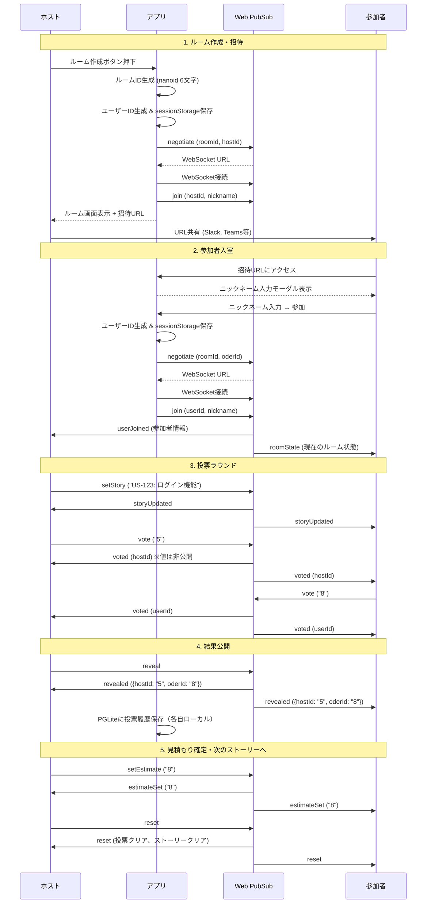

# プランニングポーカー開発仕様書

## プロジェクト概要

アジャイル開発支援ツールの第一弾として、プランニングポーカーを実装する。
将来的には他のアジャイルツール（レトロスペクティブ、バーンダウンチャート等）も追加予定。

### 技術スタック

| レイヤー | 技術 |
|---------|------|
| フロントエンド | Next.js 15 (App Router) |
| ローカルDB | PGLite (IndexedDB永続化) |
| リアルタイム通信 | Azure Web PubSub |
| ホスティング | Azure Static Web Apps |
| インフラ管理 | Bicep |
| CI/CD | GitHub Actions |

### アーキテクチャ

```
┌─────────────────────────────────────────────────────┐
│  Azure Static Web Apps (Free tier)                  │
│  ┌──────────────────┐    ┌──────────────────────┐  │
│  │  Next.js         │    │  API Functions       │  │
│  │  + PGLite        │    │  - /api/negotiate    │  │
│  │  (ブラウザ内DB)   │    │  - /api/pubsub/*     │  │
│  └──────────────────┘    └──────────────────────┘  │
└─────────────────────────────────────────────────────┘
         │                          │
         │ WebSocket                │ Webhook
         ▼                          ▼
┌─────────────────────────────────────────────────────┐
│  Azure Web PubSub (Free tier)                       │
│  - Hub: "poker"                                     │
│  - グループ = ルーム                                 │
└─────────────────────────────────────────────────────┘
```

---

## ディレクトリ構成

```
planning-poker/
├── .github/
│   └── workflows/
│       └── deploy.yml
├── infra/
│   ├── main.bicep
│   ├── main.bicepparam
│   └── modules/
│       ├── static-web-app.bicep
│       └── web-pubsub.bicep
├── src/
│   ├── app/
│   │   ├── layout.tsx
│   │   ├── page.tsx              # ホーム（ルーム作成/参加）
│   │   └── room/
│   │       └── [roomId]/
│   │           └── page.tsx      # ポーカールーム
│   ├── components/
│   │   ├── Card.tsx              # 個別カード
│   │   ├── CardDeck.tsx          # カード一覧
│   │   ├── ParticipantList.tsx   # 参加者リスト
│   │   ├── VotingResult.tsx      # 投票結果表示
│   │   ├── StoryInput.tsx        # ストーリー入力
│   │   ├── RoomControls.tsx      # ホスト用コントロール
│   │   ├── NicknameModal.tsx     # ニックネーム入力モーダル
│   │   └── InviteLink.tsx        # 招待リンク表示
│   ├── hooks/
│   │   ├── useWebPubSub.ts
│   │   ├── usePGLite.ts
│   │   └── useRoom.ts
│   ├── lib/
│   │   ├── db/
│   │   │   ├── schema.ts
│   │   │   ├── migrations.ts
│   │   │   └── queries.ts
│   │   ├── pubsub/
│   │   │   ├── client.ts
│   │   │   └── types.ts
│   │   └── utils.ts
│   └── types/
│       └── index.ts
├── api/                          # Azure Functions
│   ├── negotiate/
│   │   └── index.ts
│   └── pubsub/
│       └── events/
│           └── index.ts
├── public/
├── package.json
├── tsconfig.json
├── next.config.js
├── tailwind.config.ts
└── staticwebapp.config.json
```

---

## ユーザーフロー

### シーケンス図



### 画面遷移図

```
┌─────────────────────────────────────────────────────────────────────┐
│  ホーム画面 (/)                                                      │
│                                                                     │
│  ┌─────────────────────────────────────────────────────────────┐   │
│  │                    🃏 プランニングポーカー                    │   │
│  └─────────────────────────────────────────────────────────────┘   │
│                                                                     │
│  ┌───────────────────────┐      ┌───────────────────────┐         │
│  │   ルームを作成        │      │   ルームに参加        │         │
│  │                       │      │                       │         │
│  │  ニックネーム:        │      │  ルームID:            │         │
│  │  [______________]     │      │  [______________]     │         │
│  │                       │      │                       │         │
│  │  [✨ 作成する]        │      │  ニックネーム:        │         │
│  └───────────┬───────────┘      │  [______________]     │         │
│              │                  │                       │         │
│              │                  │  [🚀 参加する]        │         │
│              │                  └───────────┬───────────┘         │
│              │                              │                      │
└──────────────┼──────────────────────────────┼──────────────────────┘
               │                              │
               │  ルーム作成                  │  ルーム参加
               │  (ホストとして)              │  (参加者として)
               ▼                              ▼
┌─────────────────────────────────────────────────────────────────────┐
│  ポーカールーム (/room/[roomId])                                     │
│                                                                     │
│  ┌─────────────────────────────────────────────────────────────┐   │
│  │ 📋 ストーリー: US-123 ログイン機能実装      [編集] ※ホストのみ │   │
│  └─────────────────────────────────────────────────────────────┘   │
│                                                                     │
│  ┌─────────────────────┐    ┌───────────────────────────────────┐ │
│  │  👥 参加者 (3)      │    │  🎴 カードを選択                  │ │
│  │                     │    │                                   │ │
│  │  👑 山田 (ホスト) ✅│    │  ┌───┐┌───┐┌───┐┌───┐┌───┐      │ │
│  │     鈴木         ✅│    │  │ 0 ││ 1 ││ 2 ││ 3 ││ 5 │      │ │
│  │     田中         ⏳│    │  └───┘└───┘└───┘└───┘└───┘      │ │
│  │                     │    │  ┌───┐┌───┐┌───┐┌───┐┌───┐      │ │
│  │  ✅ = 投票済み      │    │  │ 8 ││13 ││21 ││ ? ││ ☕ │      │ │
│  │  ⏳ = 投票待ち      │    │  └───┘└───┘└───┘└───┘└───┘      │ │
│  └─────────────────────┘    └───────────────────────────────────┘ │
│                                                                     │
│  ┌─────────────────────────────────────────────────────────────┐   │
│  │  [🔍 カードを公開]  [🔄 リセット]  見積もり確定: [___]      │   │
│  │                                               ※ホストのみ    │   │
│  └─────────────────────────────────────────────────────────────┘   │
│                                                                     │
│  ┌─────────────────────────────────────────────────────────────┐   │
│  │  📎 招待リンク: https://example.com/room/abc123    [コピー] │   │
│  └─────────────────────────────────────────────────────────────┘   │
└─────────────────────────────────────────────────────────────────────┘

                              │
                              │ カード公開後
                              ▼

┌─────────────────────────────────────────────────────────────────────┐
│  結果表示状態                                                        │
│                                                                     │
│  ┌─────────────────────────────────────────────────────────────┐   │
│  │                      📊 投票結果                             │   │
│  │                                                             │   │
│  │    👑 山田: 5     鈴木: 8     田中: 8                       │   │
│  │                                                             │   │
│  │    平均: 7.0  |  最頻値: 8  |  範囲: 5-8                    │   │
│  └─────────────────────────────────────────────────────────────┘   │
│                                                                     │
│  ┌─────────────────────────────────────────────────────────────┐   │
│  │  見積もり確定: [ 8 ▼]  [✅ 確定してリセット]  ※ホストのみ   │   │
│  └─────────────────────────────────────────────────────────────┘   │
└─────────────────────────────────────────────────────────────────────┘
```

### 状態遷移

```
                    ストーリー設定
                         │
                         ▼
┌──────────┐       ┌──────────┐       ┌──────────┐       ┌──────────┐
│  待機中  │──────▶│  投票中  │──────▶│ 投票完了 │──────▶│ 結果表示 │
│          │ 投票  │          │ 全員  │          │ 公開  │          │
└──────────┘       └──────────┘ 投票済└──────────┘       └────┬─────┘
     ▲                                                        │
     │                        リセット                        │
     └────────────────────────────────────────────────────────┘
```

| 状態 | 参加者の表示 | 操作可能なアクション |
|-----|-------------|-------------------|
| 待機中 | 全員「⏳」 | カード選択、ストーリー編集(ホスト) |
| 投票中 | 投票者「✅」、未投票者「⏳」 | カード選択、ストーリー編集(ホスト) |
| 投票完了 | 全員「✅」 | カード公開(ホスト)、リセット(ホスト) |
| 結果表示 | カード値表示 | 見積もり確定(ホスト)、リセット(ホスト) |

### 招待フロー詳細

URLだけで参加できるシンプルな設計にする。

```
1. ホストがルーム作成
   └─▶ ルームURL生成: https://example.com/room/abc123

2. ホストがURLを共有
   └─▶ Slack/Teams/メール等で送信

3. 参加者がURLをクリック
   └─▶ /room/abc123 にアクセス

4. 初回アクセス時
   ├─▶ sessionStorageにユーザー情報なし
   └─▶ ニックネーム入力モーダル表示

5. ニックネーム入力後
   ├─▶ ユーザーID生成 (nanoid)
   ├─▶ sessionStorageに保存 (room:abc123:userId, room:abc123:nickname)
   └─▶ WebSocket接続 → ルームに参加

6. ブラウザリロード時
   ├─▶ sessionStorageからユーザー情報復元
   └─▶ 同じユーザーIDで再接続（参加者として継続）
```

### 設計上のポイント

1. **認証なしで即参加**: URLアクセス → ニックネーム入力 → 即参加
2. **ホスト権限**: ルーム作成者のみ（公開・リセット・見積もり確定）
3. **再接続対応**: sessionStorageでユーザーID保持、リロード時に復帰
4. **ルームの有効期限**: 全員退出後一定時間で自動削除（サーバーサイドで管理）

---

## 機能要件

### 1. ルーム管理

- ルーム作成（ランダムID生成）
- ルーム参加（URLまたはルームID入力）
- 参加者のニックネーム設定
- ファシリテーター権限（ルーム作成者）

### 2. 投票機能

- カード選択: 0, 1, 2, 3, 5, 8, 13, 21, ?, ☕
- 投票状態の表示（投票済み/未投票）
- カード公開（ファシリテーターのみ）
- 投票リセット

### 3. セッション管理

- ストーリー名/チケット番号の入力
- 最終見積もりの記録
- セッション履歴（PGLiteでローカル保存）

### 4. リアルタイム同期

- 参加者の入退室
- 投票状態の同期
- カード公開の同期

---

## データモデル

### PGLite スキーマ（ブラウザローカル）

```sql
-- セッション履歴
CREATE TABLE sessions (
  id TEXT PRIMARY KEY,
  room_id TEXT NOT NULL,
  created_at TIMESTAMP DEFAULT CURRENT_TIMESTAMP
);

-- 投票履歴
CREATE TABLE votes (
  id TEXT PRIMARY KEY,
  session_id TEXT NOT NULL REFERENCES sessions(id),
  story TEXT,
  my_vote TEXT,
  final_estimate TEXT,
  participants INTEGER,
  voted_at TIMESTAMP DEFAULT CURRENT_TIMESTAMP
);

-- ユーザー設定
CREATE TABLE user_settings (
  key TEXT PRIMARY KEY,
  value TEXT
);
```

### Web PubSub メッセージ型

```typescript
// src/types/index.ts

// クライアント -> サーバー
export type ClientMessage =
  | { type: 'join'; oderId: string; nickname: string }
  | { type: 'leave'; oderId: string }
  | { type: 'vote'; oderId: string; value: string }
  | { type: 'reveal' }
  | { type: 'reset' }
  | { type: 'setStory'; story: string }
  | { type: 'setEstimate'; estimate: string };

// サーバー -> クライアント
export type ServerMessage =
  | { type: 'roomState'; state: RoomState }
  | { type: 'userJoined'; user: Participant }
  | { type: 'userLeft'; oderId: string }
  | { type: 'voted'; oderId: string }
  | { type: 'revealed'; votes: Record<string, string> }
  | { type: 'reset' }
  | { type: 'storyUpdated'; story: string }
  | { type: 'estimateSet'; estimate: string };

export interface RoomState {
  roomId: string;
  story: string | null;
  participants: Participant[];
  votes: Record<string, string>; // oderId -> カード値（公開後のみ）
  isRevealed: boolean;
  facilitatorId: string;
}

export interface Participant {
  id: string;
  nickname: string;
  hasVoted: boolean;
}
```

---

## インフラ構成（Bicep）

### infra/main.bicep

```bicep
targetScope = 'resourceGroup'

@description('リソース名のプレフィックス')
param prefix string = 'poker'

@description('環境名')
@allowed(['dev', 'prod'])
param env string = 'dev'

@description('リージョン')
param location string = resourceGroup().location

@description('Static Web Apps のリポジトリURL')
param repositoryUrl string

@description('リポジトリのブランチ')
param repositoryBranch string = 'main'

var baseName = '${prefix}-${env}'

module staticWebApp 'modules/static-web-app.bicep' = {
  name: 'staticWebApp'
  params: {
    name: 'stapp-${baseName}'
    location: location
    repositoryUrl: repositoryUrl
    repositoryBranch: repositoryBranch
    webPubSubConnectionString: webPubSub.outputs.connectionString
  }
}

module webPubSub 'modules/web-pubsub.bicep' = {
  name: 'webPubSub'
  params: {
    name: 'wps-${baseName}'
    location: location
  }
}

output staticWebAppUrl string = staticWebApp.outputs.defaultHostname
output staticWebAppName string = staticWebApp.outputs.name
output webPubSubHostname string = webPubSub.outputs.hostname
```

### infra/main.bicepparam

```bicep
using './main.bicep'

param prefix = 'poker'
param env = 'dev'
param location = 'japaneast'
param repositoryUrl = 'https://github.com/YOUR_ORG/planning-poker'
param repositoryBranch = 'main'
```

### infra/modules/web-pubsub.bicep

```bicep
@description('Web PubSub名')
param name string

@description('リージョン')
param location string

@description('SKU')
@allowed(['Free_F1', 'Standard_S1'])
param sku string = 'Free_F1'

resource webPubSub 'Microsoft.SignalRService/webPubSub@2024-03-01' = {
  name: name
  location: location
  sku: {
    name: sku
    capacity: 1
  }
  properties: {
    tls: {
      clientCertEnabled: false
    }
    publicNetworkAccess: 'Enabled'
  }
}

resource pokerHub 'Microsoft.SignalRService/webPubSub/hubs@2024-03-01' = {
  parent: webPubSub
  name: 'poker'
  properties: {
    eventHandlers: [
      {
        urlTemplate: 'https://{staticWebAppHostname}/api/pubsub/events'
        userEventPattern: '*'
        systemEvents: [
          'connect'
          'connected'
          'disconnected'
        ]
      }
    ]
    anonymousConnectPolicy: 'deny'
  }
}

output id string = webPubSub.id
output hostname string = webPubSub.properties.hostName
output connectionString string = webPubSub.listKeys().primaryConnectionString
```

### infra/modules/static-web-app.bicep

```bicep
@description('Static Web App名')
param name string

@description('リージョン')
param location string

@description('GitHubリポジトリURL')
param repositoryUrl string

@description('ブランチ')
param repositoryBranch string

@description('Web PubSub接続文字列')
@secure()
param webPubSubConnectionString string

resource staticWebApp 'Microsoft.Web/staticSites@2023-12-01' = {
  name: name
  location: location
  sku: {
    name: 'Free'
    tier: 'Free'
  }
  properties: {
    repositoryUrl: repositoryUrl
    branch: repositoryBranch
    stagingEnvironmentPolicy: 'Enabled'
    allowConfigFileUpdates: true
    buildProperties: {
      appLocation: '/'
      apiLocation: 'api'
      outputLocation: '.next'
      skipGithubActionWorkflowGeneration: true
    }
  }
}

resource appSettings 'Microsoft.Web/staticSites/config@2023-12-01' = {
  parent: staticWebApp
  name: 'appsettings'
  properties: {
    WEB_PUBSUB_CONNECTION_STRING: webPubSubConnectionString
  }
}

output id string = staticWebApp.id
output name string = staticWebApp.name
output defaultHostname string = staticWebApp.properties.defaultHostname
```

---

## 実装詳細

### 1. ルーム管理フック

```typescript
// src/hooks/useRoom.ts
import { useCallback, useEffect, useState } from 'react';
import { nanoid } from 'nanoid';

interface UserInfo {
  oderId: string;
  nickname: string;
}

// ルームIDの生成（6文字の英数字）
export const generateRoomId = () => nanoid(6);

// ユーザーIDの生成
export const generateUserId = () => nanoid(10);

// セッションストレージキー
const getUserKey = (roomId: string) => `room:${roomId}:user`;

// ユーザー情報の保存
export function saveUserInfo(roomId: string, userInfo: UserInfo) {
  sessionStorage.setItem(getUserKey(roomId), JSON.stringify(userInfo));
}

// ユーザー情報の取得
export function getUserInfo(roomId: string): UserInfo | null {
  const data = sessionStorage.getItem(getUserKey(roomId));
  if (!data) return null;
  try {
    return JSON.parse(data);
  } catch {
    return null;
  }
}

// ユーザー情報のクリア
export function clearUserInfo(roomId: string) {
  sessionStorage.removeItem(getUserKey(roomId));
}

// ルーム参加フック
export function useRoomUser(roomId: string) {
  const [userInfo, setUserInfo] = useState<UserInfo | null>(null);
  const [isLoading, setIsLoading] = useState(true);

  useEffect(() => {
    const stored = getUserInfo(roomId);
    setUserInfo(stored);
    setIsLoading(false);
  }, [roomId]);

  const joinRoom = useCallback((nickname: string) => {
    const info: UserInfo = {
      oderId: generateUserId(),
      nickname,
    };
    saveUserInfo(roomId, info);
    setUserInfo(info);
    return info;
  }, [roomId]);

  const leaveRoom = useCallback(() => {
    clearUserInfo(roomId);
    setUserInfo(null);
  }, [roomId]);

  return {
    userInfo,
    isLoading,
    needsNickname: !isLoading && !userInfo,
    joinRoom,
    leaveRoom,
  };
}
```

### 2. Web PubSub クライアント

```typescript
// src/hooks/useWebPubSub.ts
import { useCallback, useEffect, useRef, useState } from 'react';
import type { ClientMessage, ServerMessage } from '@/types';

interface UseWebPubSubOptions {
  roomId: string;
  oderId: string;
  nickname: string;
  onMessage: (message: ServerMessage) => void;
  enabled?: boolean;
}

export function useWebPubSub({ 
  roomId, 
  oderId, 
  nickname, 
  onMessage,
  enabled = true,
}: UseWebPubSubOptions) {
  const wsRef = useRef<WebSocket | null>(null);
  const [isConnected, setIsConnected] = useState(false);
  const [error, setError] = useState<Error | null>(null);

  const connect = useCallback(async () => {
    if (!enabled || !oderId) return;
    
    try {
      const res = await fetch(`/api/negotiate?roomId=${roomId}&userId=${oderId}`);
      if (!res.ok) throw new Error('Failed to negotiate');
      const { url } = await res.json();

      const ws = new WebSocket(url);
      wsRef.current = ws;

      ws.onopen = () => {
        setIsConnected(true);
        // 入室通知
        send({ type: 'join', oderId, nickname });
      };

      ws.onmessage = (event) => {
        const message = JSON.parse(event.data) as ServerMessage;
        onMessage(message);
      };

      ws.onerror = () => {
        setError(new Error('WebSocket error'));
      };

      ws.onclose = () => {
        setIsConnected(false);
      };
    } catch (e) {
      setError(e instanceof Error ? e : new Error('Unknown error'));
    }
  }, [roomId, oderId, nickname, onMessage, enabled]);

  const send = useCallback((message: ClientMessage) => {
    if (wsRef.current?.readyState === WebSocket.OPEN) {
      wsRef.current.send(JSON.stringify({
        type: 'sendToGroup',
        group: roomId,
        data: message,
      }));
    }
  }, [roomId]);

  const disconnect = useCallback(() => {
    if (oderId) {
      send({ type: 'leave', oderId });
    }
    wsRef.current?.close();
  }, [send, oderId]);

  useEffect(() => {
    connect();
    return () => disconnect();
  }, [connect, disconnect]);

  return { isConnected, error, send };
}
```

### 2. PGLite フック

```typescript
// src/hooks/usePGLite.ts
import { useEffect, useState } from 'react';
import { PGlite } from '@electric-sql/pglite';

let dbInstance: PGlite | null = null;

async function getDB(): Promise<PGlite> {
  if (!dbInstance) {
    dbInstance = new PGlite('idb://planning-poker');
    await initSchema(dbInstance);
  }
  return dbInstance;
}

async function initSchema(db: PGlite) {
  await db.exec(`
    CREATE TABLE IF NOT EXISTS sessions (
      id TEXT PRIMARY KEY,
      room_id TEXT NOT NULL,
      created_at TIMESTAMP DEFAULT CURRENT_TIMESTAMP
    );

    CREATE TABLE IF NOT EXISTS votes (
      id TEXT PRIMARY KEY,
      session_id TEXT NOT NULL,
      story TEXT,
      my_vote TEXT,
      final_estimate TEXT,
      participants INTEGER,
      voted_at TIMESTAMP DEFAULT CURRENT_TIMESTAMP
    );

    CREATE TABLE IF NOT EXISTS user_settings (
      key TEXT PRIMARY KEY,
      value TEXT
    );
  `);
}

export function usePGLite() {
  const [db, setDb] = useState<PGlite | null>(null);
  const [isReady, setIsReady] = useState(false);

  useEffect(() => {
    getDB().then((instance) => {
      setDb(instance);
      setIsReady(true);
    });
  }, []);

  return { db, isReady };
}

// クエリヘルパー
export async function saveVote(db: PGlite, vote: {
  sessionId: string;
  story: string;
  myVote: string;
  finalEstimate: string;
  participants: number;
}) {
  const id = crypto.randomUUID();
  await db.query(
    `INSERT INTO votes (id, session_id, story, my_vote, final_estimate, participants)
     VALUES ($1, $2, $3, $4, $5, $6)`,
    [id, vote.sessionId, vote.story, vote.myVote, vote.finalEstimate, vote.participants]
  );
  return id;
}

export async function getVoteHistory(db: PGlite, limit = 50) {
  const result = await db.query<{
    id: string;
    story: string;
    my_vote: string;
    final_estimate: string;
    participants: number;
    voted_at: string;
  }>(
    `SELECT * FROM votes ORDER BY voted_at DESC LIMIT $1`,
    [limit]
  );
  return result.rows;
}

export async function getUserSetting(db: PGlite, key: string): Promise<string | null> {
  const result = await db.query<{ value: string }>(
    `SELECT value FROM user_settings WHERE key = $1`,
    [key]
  );
  return result.rows[0]?.value ?? null;
}

export async function setUserSetting(db: PGlite, key: string, value: string) {
  await db.query(
    `INSERT INTO user_settings (key, value) VALUES ($1, $2)
     ON CONFLICT (key) DO UPDATE SET value = $2`,
    [key, value]
  );
}
```

### 4. ニックネーム入力モーダル

```typescript
// src/components/NicknameModal.tsx
'use client';

import { useState } from 'react';

interface NicknameModalProps {
  onSubmit: (nickname: string) => void;
  isHost?: boolean;
}

export function NicknameModal({ onSubmit, isHost = false }: NicknameModalProps) {
  const [nickname, setNickname] = useState('');
  const [error, setError] = useState('');

  const handleSubmit = (e: React.FormEvent) => {
    e.preventDefault();
    const trimmed = nickname.trim();
    if (trimmed.length < 1) {
      setError('ニックネームを入力してください');
      return;
    }
    if (trimmed.length > 20) {
      setError('ニックネームは20文字以内で入力してください');
      return;
    }
    onSubmit(trimmed);
  };

  return (
    <div className="fixed inset-0 bg-black/50 flex items-center justify-center z-50">
      <div className="bg-white rounded-lg p-6 w-full max-w-md mx-4 shadow-xl">
        <h2 className="text-xl font-bold mb-4">
          {isHost ? 'ルームを作成' : 'ルームに参加'}
        </h2>
        <form onSubmit={handleSubmit}>
          <div className="mb-4">
            <label htmlFor="nickname" className="block text-sm font-medium mb-2">
              ニックネーム
            </label>
            <input
              type="text"
              id="nickname"
              value={nickname}
              onChange={(e) => {
                setNickname(e.target.value);
                setError('');
              }}
              placeholder="例: 山田"
              className="w-full px-3 py-2 border rounded-lg focus:outline-none focus:ring-2 focus:ring-blue-500"
              autoFocus
              maxLength={20}
            />
            {error && <p className="text-red-500 text-sm mt-1">{error}</p>}
          </div>
          <button
            type="submit"
            className="w-full bg-blue-600 text-white py-2 px-4 rounded-lg hover:bg-blue-700 transition-colors"
          >
            {isHost ? '作成する' : '参加する'}
          </button>
        </form>
      </div>
    </div>
  );
}
```

### 5. ホーム画面

```typescript
// src/app/page.tsx
'use client';

import { useState } from 'react';
import { useRouter } from 'next/navigation';
import { generateRoomId, generateUserId, saveUserInfo } from '@/hooks/useRoom';

export default function HomePage() {
  const router = useRouter();
  const [nickname, setNickname] = useState('');
  const [roomIdInput, setRoomIdInput] = useState('');
  const [joinNickname, setJoinNickname] = useState('');

  // ルーム作成
  const handleCreateRoom = (e: React.FormEvent) => {
    e.preventDefault();
    if (!nickname.trim()) return;

    const roomId = generateRoomId();
    const oderId = generateUserId();
    
    // ホストとしてユーザー情報を保存（isHost フラグ付き）
    saveUserInfo(roomId, {
      oderId,
      nickname: nickname.trim(),
    });
    // ホスト情報は別途保存
    sessionStorage.setItem(`room:${roomId}:host`, oderId);

    router.push(`/room/${roomId}`);
  };

  // ルーム参加
  const handleJoinRoom = (e: React.FormEvent) => {
    e.preventDefault();
    if (!roomIdInput.trim() || !joinNickname.trim()) return;

    const roomId = roomIdInput.trim().toLowerCase();
    const oderId = generateUserId();
    
    saveUserInfo(roomId, {
      oderId,
      nickname: joinNickname.trim(),
    });

    router.push(`/room/${roomId}`);
  };

  return (
    <main className="min-h-screen bg-gradient-to-b from-blue-50 to-white">
      <div className="container mx-auto px-4 py-16">
        <h1 className="text-4xl font-bold text-center mb-12">
          🃏 プランニングポーカー
        </h1>

        <div className="max-w-2xl mx-auto grid md:grid-cols-2 gap-8">
          {/* ルーム作成 */}
          <div className="bg-white p-6 rounded-xl shadow-lg">
            <h2 className="text-xl font-semibold mb-4">ルームを作成</h2>
            <form onSubmit={handleCreateRoom}>
              <div className="mb-4">
                <label className="block text-sm font-medium mb-2">
                  ニックネーム
                </label>
                <input
                  type="text"
                  value={nickname}
                  onChange={(e) => setNickname(e.target.value)}
                  placeholder="例: 山田"
                  className="w-full px-3 py-2 border rounded-lg"
                  maxLength={20}
                />
              </div>
              <button
                type="submit"
                disabled={!nickname.trim()}
                className="w-full bg-blue-600 text-white py-2 px-4 rounded-lg hover:bg-blue-700 disabled:bg-gray-300 disabled:cursor-not-allowed"
              >
                ✨ 作成する
              </button>
            </form>
          </div>

          {/* ルーム参加 */}
          <div className="bg-white p-6 rounded-xl shadow-lg">
            <h2 className="text-xl font-semibold mb-4">ルームに参加</h2>
            <form onSubmit={handleJoinRoom}>
              <div className="mb-4">
                <label className="block text-sm font-medium mb-2">
                  ルームID
                </label>
                <input
                  type="text"
                  value={roomIdInput}
                  onChange={(e) => setRoomIdInput(e.target.value)}
                  placeholder="例: abc123"
                  className="w-full px-3 py-2 border rounded-lg"
                  maxLength={10}
                />
              </div>
              <div className="mb-4">
                <label className="block text-sm font-medium mb-2">
                  ニックネーム
                </label>
                <input
                  type="text"
                  value={joinNickname}
                  onChange={(e) => setJoinNickname(e.target.value)}
                  placeholder="例: 鈴木"
                  className="w-full px-3 py-2 border rounded-lg"
                  maxLength={20}
                />
              </div>
              <button
                type="submit"
                disabled={!roomIdInput.trim() || !joinNickname.trim()}
                className="w-full bg-green-600 text-white py-2 px-4 rounded-lg hover:bg-green-700 disabled:bg-gray-300 disabled:cursor-not-allowed"
              >
                🚀 参加する
              </button>
            </form>
          </div>
        </div>
      </div>
    </main>
  );
}
```

### 6. ポーカールーム画面

```typescript
// src/app/room/[roomId]/page.tsx
'use client';

import { useParams } from 'next/navigation';
import { useEffect, useState, useCallback } from 'react';
import { useRoomUser, getUserInfo } from '@/hooks/useRoom';
import { useWebPubSub } from '@/hooks/useWebPubSub';
import { NicknameModal } from '@/components/NicknameModal';
import type { RoomState, ServerMessage } from '@/types';

const CARDS = ['0', '1', '2', '3', '5', '8', '13', '21', '?', '☕'];

export default function RoomPage() {
  const params = useParams();
  const roomId = params.roomId as string;
  
  const { userInfo, isLoading, needsNickname, joinRoom } = useRoomUser(roomId);
  const [roomState, setRoomState] = useState<RoomState | null>(null);
  const [selectedCard, setSelectedCard] = useState<string | null>(null);
  const [isHost, setIsHost] = useState(false);

  // ホスト判定
  useEffect(() => {
    const hostId = sessionStorage.getItem(`room:${roomId}:host`);
    if (userInfo && hostId === userInfo.oderId) {
      setIsHost(true);
    }
  }, [roomId, userInfo]);

  // メッセージハンドラー
  const handleMessage = useCallback((message: ServerMessage) => {
    switch (message.type) {
      case 'roomState':
        setRoomState(message.state);
        break;
      case 'userJoined':
        setRoomState(prev => prev ? {
          ...prev,
          participants: [...prev.participants, message.user],
        } : null);
        break;
      case 'userLeft':
        setRoomState(prev => prev ? {
          ...prev,
          participants: prev.participants.filter(p => p.id !== message.oderId),
        } : null);
        break;
      case 'voted':
        setRoomState(prev => prev ? {
          ...prev,
          participants: prev.participants.map(p =>
            p.id === message.oderId ? { ...p, hasVoted: true } : p
          ),
        } : null);
        break;
      case 'revealed':
        setRoomState(prev => prev ? {
          ...prev,
          isRevealed: true,
          votes: message.votes,
        } : null);
        break;
      case 'reset':
        setRoomState(prev => prev ? {
          ...prev,
          isRevealed: false,
          votes: {},
          story: null,
          participants: prev.participants.map(p => ({ ...p, hasVoted: false })),
        } : null);
        setSelectedCard(null);
        break;
      case 'storyUpdated':
        setRoomState(prev => prev ? { ...prev, story: message.story } : null);
        break;
    }
  }, []);

  const { isConnected, send } = useWebPubSub({
    roomId,
    oderId: userInfo?.oderId ?? '',
    nickname: userInfo?.nickname ?? '',
    onMessage: handleMessage,
    enabled: !!userInfo,
  });

  // カード選択
  const handleCardSelect = (card: string) => {
    setSelectedCard(card);
    send({ type: 'vote', oderId: userInfo!.oderId, value: card });
  };

  // カード公開
  const handleReveal = () => {
    send({ type: 'reveal' });
  };

  // リセット
  const handleReset = () => {
    send({ type: 'reset' });
  };

  // 招待リンクコピー
  const handleCopyLink = () => {
    const url = window.location.href;
    navigator.clipboard.writeText(url);
    alert('招待リンクをコピーしました');
  };

  if (isLoading) {
    return <div className="min-h-screen flex items-center justify-center">読み込み中...</div>;
  }

  if (needsNickname) {
    return <NicknameModal onSubmit={(nickname) => joinRoom(nickname)} />;
  }

  return (
    <main className="min-h-screen bg-gray-50 p-4">
      <div className="max-w-4xl mx-auto">
        {/* ヘッダー */}
        <div className="bg-white rounded-lg shadow p-4 mb-4">
          <div className="flex justify-between items-center">
            <h1 className="text-xl font-bold">🃏 ルーム: {roomId}</h1>
            <span className={`px-2 py-1 rounded text-sm ${isConnected ? 'bg-green-100 text-green-800' : 'bg-red-100 text-red-800'}`}>
              {isConnected ? '接続中' : '接続中...'}
            </span>
          </div>
        </div>

        {/* ストーリー */}
        <div className="bg-white rounded-lg shadow p-4 mb-4">
          <div className="flex items-center gap-2">
            <span className="font-medium">📋 ストーリー:</span>
            <span className="text-gray-700">
              {roomState?.story || '（未設定）'}
            </span>
            {isHost && (
              <button
                onClick={() => {
                  const story = prompt('ストーリー名を入力', roomState?.story || '');
                  if (story !== null) {
                    send({ type: 'setStory', story });
                  }
                }}
                className="ml-auto text-blue-600 text-sm"
              >
                編集
              </button>
            )}
          </div>
        </div>

        <div className="grid md:grid-cols-3 gap-4 mb-4">
          {/* 参加者リスト */}
          <div className="bg-white rounded-lg shadow p-4">
            <h2 className="font-bold mb-3">👥 参加者 ({roomState?.participants.length || 0})</h2>
            <ul className="space-y-2">
              {roomState?.participants.map((p) => (
                <li key={p.id} className="flex items-center gap-2">
                  {p.id === roomState.facilitatorId && <span>👑</span>}
                  <span>{p.nickname}</span>
                  <span className="ml-auto">
                    {roomState.isRevealed
                      ? roomState.votes[p.id] || '-'
                      : p.hasVoted ? '✅' : '⏳'}
                  </span>
                </li>
              ))}
            </ul>
          </div>

          {/* カード選択 */}
          <div className="md:col-span-2 bg-white rounded-lg shadow p-4">
            <h2 className="font-bold mb-3">🎴 カードを選択</h2>
            <div className="grid grid-cols-5 gap-2">
              {CARDS.map((card) => (
                <button
                  key={card}
                  onClick={() => handleCardSelect(card)}
                  disabled={roomState?.isRevealed}
                  className={`
                    aspect-[2/3] rounded-lg border-2 text-xl font-bold
                    transition-all hover:scale-105
                    ${selectedCard === card
                      ? 'border-blue-500 bg-blue-50 text-blue-700'
                      : 'border-gray-200 hover:border-gray-300'}
                    ${roomState?.isRevealed ? 'opacity-50 cursor-not-allowed' : ''}
                  `}
                >
                  {card}
                </button>
              ))}
            </div>
          </div>
        </div>

        {/* ホスト用コントロール */}
        {isHost && (
          <div className="bg-white rounded-lg shadow p-4 mb-4">
            <div className="flex flex-wrap gap-2">
              <button
                onClick={handleReveal}
                disabled={roomState?.isRevealed}
                className="bg-blue-600 text-white px-4 py-2 rounded-lg hover:bg-blue-700 disabled:bg-gray-300"
              >
                🔍 カードを公開
              </button>
              <button
                onClick={handleReset}
                className="bg-gray-600 text-white px-4 py-2 rounded-lg hover:bg-gray-700"
              >
                🔄 リセット
              </button>
            </div>
          </div>
        )}

        {/* 招待リンク */}
        <div className="bg-white rounded-lg shadow p-4">
          <div className="flex items-center gap-2">
            <span className="text-sm text-gray-600">📎 招待リンク:</span>
            <code className="flex-1 bg-gray-100 px-2 py-1 rounded text-sm truncate">
              {typeof window !== 'undefined' ? window.location.href : ''}
            </code>
            <button
              onClick={handleCopyLink}
              className="bg-gray-200 px-3 py-1 rounded text-sm hover:bg-gray-300"
            >
              コピー
            </button>
          </div>
        </div>
      </div>
    </main>
  );
}
```

### 7. API: negotiate エンドポイント

```typescript
// api/negotiate/index.ts
import { AzureFunction, Context, HttpRequest } from '@azure/functions';
import { WebPubSubServiceClient } from '@azure/web-pubsub';

const negotiate: AzureFunction = async (context: Context, req: HttpRequest) => {
  const roomId = req.query.roomId;
  const userId = req.query.userId;

  if (!roomId || !userId) {
    context.res = {
      status: 400,
      body: { error: 'roomId and userId are required' },
    };
    return;
  }

  const connectionString = process.env.WEB_PUBSUB_CONNECTION_STRING;
  if (!connectionString) {
    context.res = {
      status: 500,
      body: { error: 'Server configuration error' },
    };
    return;
  }

  const client = new WebPubSubServiceClient(connectionString, 'poker');

  const token = await client.getClientAccessToken({
    userId,
    groups: [roomId],
    roles: [
      'webpubsub.sendToGroup',
      'webpubsub.joinLeaveGroup',
    ],
  });

  context.res = {
    body: { url: token.url },
  };
};

export default negotiate;
```

### 8. API: イベントハンドラー

```typescript
// api/pubsub/events/index.ts
import { AzureFunction, Context, HttpRequest } from '@azure/functions';
import { WebPubSubServiceClient } from '@azure/web-pubsub';

// インメモリでルーム状態を管理（本番ではRedis等を検討）
const rooms = new Map<string, RoomState>();

interface RoomState {
  participants: Map<string, { nickname: string; hasVoted: boolean }>;
  votes: Map<string, string>;
  story: string | null;
  isRevealed: boolean;
  facilitatorId: string | null;
}

const eventHandler: AzureFunction = async (context: Context, req: HttpRequest) => {
  const connectionString = process.env.WEB_PUBSUB_CONNECTION_STRING!;
  const client = new WebPubSubServiceClient(connectionString, 'poker');

  const eventType = req.headers['ce-type'];
  const userId = req.headers['ce-userid'] as string;
  const connectionId = req.headers['ce-connectionid'] as string;

  // システムイベント
  if (eventType === 'azure.webpubsub.sys.connected') {
    context.log(`User ${userId} connected`);
    context.res = { status: 200 };
    return;
  }

  if (eventType === 'azure.webpubsub.sys.disconnected') {
    context.log(`User ${userId} disconnected`);
    // ルームから削除する処理
    context.res = { status: 200 };
    return;
  }

  // ユーザーイベント
  if (eventType === 'azure.webpubsub.user.message') {
    const message = req.body;
    context.log('Received message:', message);

    // メッセージ処理ロジック
    // 実際の実装ではルーム状態の管理とブロードキャストを行う

    context.res = { status: 200 };
    return;
  }

  context.res = { status: 200 };
};

export default eventHandler;
```

### 9. Next.js 設定

```javascript
// next.config.js
/** @type {import('next').NextConfig} */
const nextConfig = {
  output: 'standalone',
  // Static Web Apps用の設定
  images: {
    unoptimized: true,
  },
};

module.exports = nextConfig;
```

```json
// staticwebapp.config.json
{
  "navigationFallback": {
    "rewrite": "/index.html",
    "exclude": ["/api/*", "/_next/*", "/static/*"]
  },
  "routes": [
    {
      "route": "/api/*",
      "allowedRoles": ["anonymous"]
    }
  ],
  "platform": {
    "apiRuntime": "node:18"
  }
}
```

### 10. GitHub Actions

```yaml
# .github/workflows/deploy.yml
name: Deploy to Azure Static Web Apps

on:
  push:
    branches: [main]
  pull_request:
    types: [opened, synchronize, reopened, closed]
    branches: [main]

jobs:
  build_and_deploy:
    if: github.event_name == 'push' || (github.event_name == 'pull_request' && github.event.action != 'closed')
    runs-on: ubuntu-latest
    name: Build and Deploy
    steps:
      - uses: actions/checkout@v4

      - name: Setup Node.js
        uses: actions/setup-node@v4
        with:
          node-version: '20'
          cache: 'npm'

      - name: Install dependencies
        run: npm ci

      - name: Build
        run: npm run build

      - name: Deploy to Azure Static Web Apps
        uses: Azure/static-web-apps-deploy@v1
        with:
          azure_static_web_apps_api_token: ${{ secrets.AZURE_STATIC_WEB_APPS_API_TOKEN }}
          repo_token: ${{ secrets.GITHUB_TOKEN }}
          action: 'upload'
          app_location: '/'
          api_location: 'api'
          output_location: '.next'

  close_pull_request:
    if: github.event_name == 'pull_request' && github.event.action == 'closed'
    runs-on: ubuntu-latest
    name: Close Pull Request
    steps:
      - name: Close Pull Request
        uses: Azure/static-web-apps-deploy@v1
        with:
          azure_static_web_apps_api_token: ${{ secrets.AZURE_STATIC_WEB_APPS_API_TOKEN }}
          action: 'close'
```

---

## 開発手順

### 1. ローカル開発環境セットアップ

```bash
# プロジェクト作成
npx create-next-app@latest planning-poker --typescript --tailwind --app --src-dir

cd planning-poker

# 依存関係インストール
npm install @electric-sql/pglite @azure/web-pubsub nanoid
npm install -D @types/uuid

# Azure Functions Core Tools（ローカルAPI開発用）
npm install -g azure-functions-core-tools@4
```

### 2. ローカル実行

```bash
# Next.js開発サーバー
npm run dev

# API Functions（別ターミナル）
cd api && func start
```

### 3. Azureデプロイ

```bash
# リソースグループ作成
az group create --name rg-poker-dev --location japaneast

# Bicepデプロイ
az deployment group create \
  --resource-group rg-poker-dev \
  --template-file infra/main.bicep \
  --parameters infra/main.bicepparam

# デプロイトークン取得
DEPLOY_TOKEN=$(az staticwebapp secrets list \
  --name stapp-poker-dev \
  --resource-group rg-poker-dev \
  --query "properties.apiKey" -o tsv)

# GitHub Secretsに登録
gh secret set AZURE_STATIC_WEB_APPS_API_TOKEN --body "$DEPLOY_TOKEN"
```

---

## コスト試算

| サービス | Tier | 月額 |
|---------|------|------|
| Static Web Apps | Free | ¥0 |
| Web PubSub | Free (20同時接続) | ¥0 |
| **合計** | | **¥0** |

---

## 将来の拡張案

1. **認証追加**: Static Web Apps組み込み認証（GitHub/Microsoft）
2. **チーム機能**: 永続的なチーム/ルーム管理
3. **Jira連携**: ストーリー自動取得
4. **分析機能**: 見積もり精度の統計
5. **他ツール**: レトロスペクティブ、バーンダウンチャート

---

## 注意事項

1. **Web PubSub Hub設定**: デプロイ後、Static Web Appのホスト名が確定したらHub設定のイベントハンドラーURLを更新する必要あり
2. **Free tier制限**: 20同時接続、1日2万メッセージ
3. **PGLiteはブラウザローカル**: データはデバイス間で同期されない
